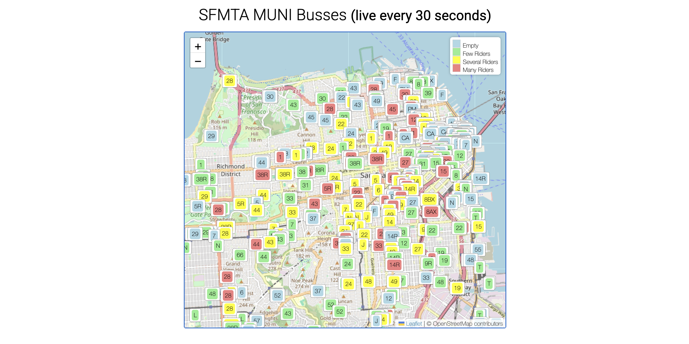
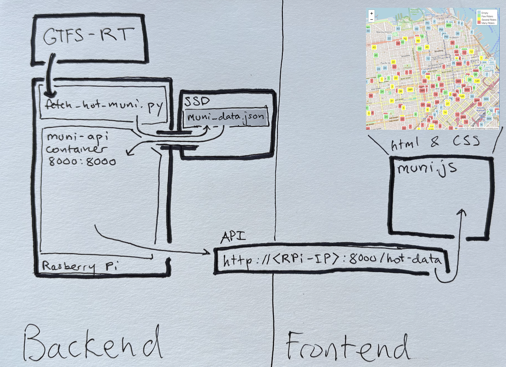

# Real-Time SFMTA MUNI Bus Tracker
### (Live at https://polar3197.github.io/map/)

A full-stack system for visualizing San Francisco MUNI buses and their occupancy levels in real time. This project pulls GTFS-RT data from the SFMTA public feed, stores the results on an SSD attached to a Raspberry Pi, and serves a live map via a containerized FastAPI endpoint and Leaflet frontend.

<p align="center">  </p>
<sub><p align="center">Map shows real-time vehicle positions and occupancy levels every 30 seconds</p></sub>

---

## How to Visualize (after completing the Setup)

Open `frontend/index.html` in your browser, or visit:
```http:/<IP-addr-where-api-container-runs>:8000/hot-data``` to see the raw JSON served by the API.

## Features

- **Live Data**: Updates every 30 seconds using the SFMTA GTFS-RT feed
- **Occupancy Visualization**: Color-coded bus labels for rider density
- **Containerized Backend**: FastAPI app runs in a lightweight Docker container
- **Embedded Deployment**: Runs on a Raspberry Pi with attached SSD
- **Frontend Map**: HTML + JS + Leaflet for dynamic vehicle display

---

## System Architecture

<p align="center">
  
</p>

The Raspberry Pi periodically fetches GTFS-RT vehicle data using `fetch_hot_muni.py`, which stores a JSON snapshot on an attached SSD. A containerized FastAPI app (`hot-service.py`) serves this data on port `8000`. The frontend, built with HTML/CSS/JS, polls this API every 30 seconds and visualizes live bus occupancy on a Leaflet map.

---

## Repo Structure
muni_map

```bash
muni_map
├── api
│   ├── fetch_hot_muni.py # fetches GTFS-RT data and saves to SSD
│   └── hot-service.py # serves JSON via FastAPI
├── assets
│   └── system_diagram.png # architecture sketch
├── Dockerfile # builds the FastAPI container
├── frontend
│   ├── index.html # main page with Leaflet map
│   ├── muni.js # handles polling and rendering
│   └── style.css # map and legend styling
├── README.md
└── requirements.txt # Python requirements for fetch script and docker
```
---

## Setup Instructions

### Fetching Live MUNI Vehicle Data

The `fetch_hot_muni.py` script pulls live vehicle data every 30 seconds and stores it in a shared JSON file on disk. The API serves this file.

You can run this script as I do, with a 30-second while loop, or you can remove the loop and schedule a cron job. Below are the commands for each

1. **While loop:**
```bash
# create suitable venv
python3 -m venv venv
source venv/bin/activate
pip install -r requirements.txt
```
```bash
# while loop
python api/fetch_hot_muni.py # make sure you are using your virtual 
```
2. **cron**
```bash
# using cron
crontab -e
```
then add
```bash
* * * * * sleep 30; /path/to/venv/bin/python /path/to/muni_map/api/fetch_hot_muni.py
```

## Build api container and run it
In `muni_map`, run
```bash
docker build -t muni-api .

# Run and mount SSD volume
docker run -d -p 8000:8000 \
  -v /path/to/json:/data \       # your path to json is defined by you in fetch_hot_muni.py by setting output_dir
  -e HOT_DATA_PATH=/data/map_data.json \
  muni-api
```


